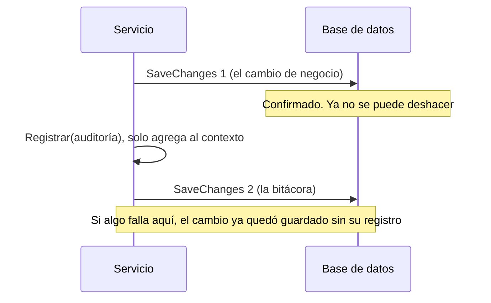
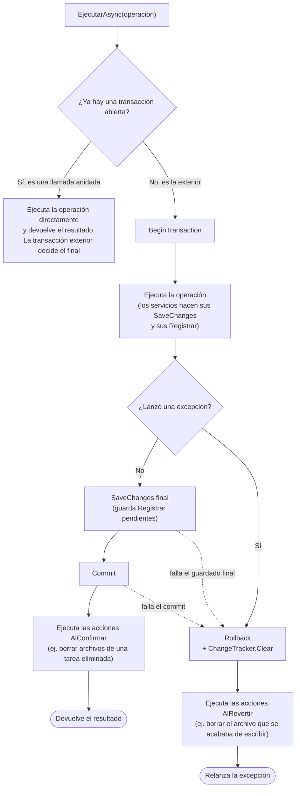
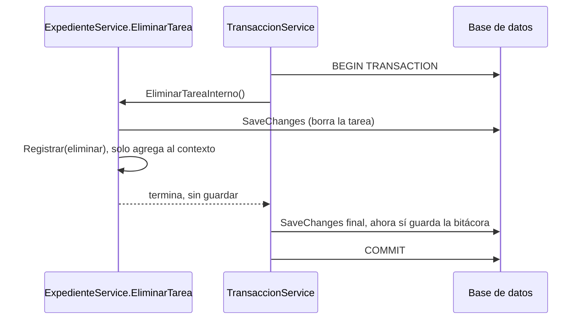
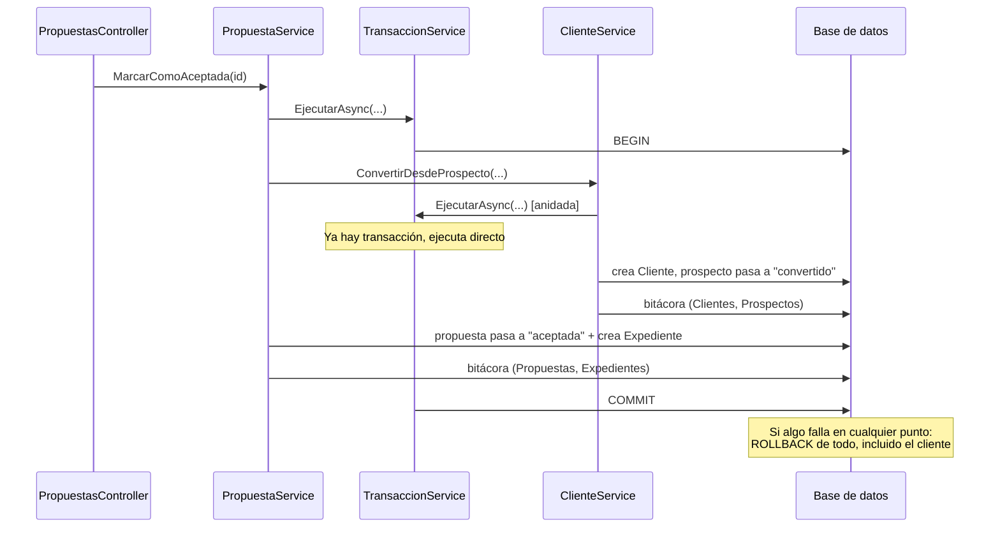
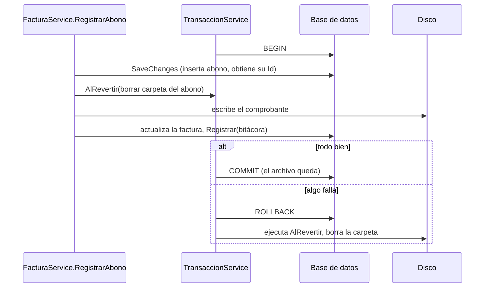
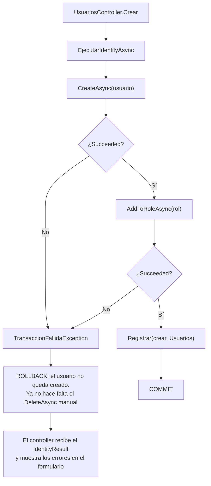

# Auditoría y transaccionalidad (MT-002)

> **Tarea técnica:** MT-002, issue #50 · **Requisitos:** RNF-006 (integridad de datos) y RNF-002 (trazabilidad) · **Rama:** `mt-002-transaccionalidad-auditoria`

Este documento explica **qué problema había, cómo funciona la solución, dónde se aplicó y cómo se probó**.

## 1. Resumen en una frase

Toda operación crítica se ejecuta dentro de **una sola transacción de base de datos** que incluye el cambio de negocio **y** su registro de auditoría: o se guardan los dos, o no se guarda ninguno.

## 2. El problema

### 2.1 Cómo se guardaba antes

Cada servicio hacía varios `SaveChangesAsync()` seguidos, sin ninguna transacción que los uniera. Cada uno era una transacción independiente:



### 2.2 Qué consecuencias tenía

| Caso | Qué podía quedar a medias |
|---|---|
| Aceptar una propuesta de un prospecto | Cliente creado y prospecto convertido, pero la propuesta seguía "enviada" y sin expediente. Reintentar daba "el prospecto ya no está activo" y no había forma de recuperarlo desde la interfaz. |
| Guardar permisos de un rol | Cada permiso se guardaba solo. Un fallo dejaba el rol con permisos que nadie eligió. |
| Crear usuario | Se creaba el usuario y luego el rol; si el rol fallaba se hacía un `DeleteAsync` manual (que también podía fallar). |
| Editar usuario | Datos ya actualizados pero rol sin cambiar, o usuario sin ningún rol. |
| Abono con comprobante | Registro creado sin archivo, o archivo en disco sin registro. |
| Cualquier cambio + bitácora | Cambio guardado sin su registro de auditoría (viola RNF-002). |

### 2.3 Hallazgo adicional: auditorías que se perdían en silencio

`IBitacoraAuditoriaService.Registrar` **solo agrega la fila al contexto; no guarda**. Tres métodos de `ExpedienteService` llamaban a `Registrar` como última instrucción y **nunca guardaban después**, así que su registro de auditoría jamás llegaba a la base:

- `AgregarArchivoEntregable` (adjuntar archivos)
- `EliminarArchivoEntregable`
- `EliminarTarea`

Se comprobó con datos reales: había **15 archivos de entregables adjuntados y 0 registros** de auditoría de esa acción. La solución de este documento lo corrige sin tocar esas llamadas (ver §3.3).

## 3. La solución

### 3.1 Ideas clave

1. **Un solo `DbContext` por petición.** `UserManager` y `RoleManager` de Identity usan ese mismo contexto. Una transacción sobre él cubre servicios de negocio **e** Identity.
2. **Una transacción reentrante** (`ITransaccionService`). Si ya hay una abierta, la operación se une a ella; si no, abre una. Así una operación puede llamar a otra (aceptar propuesta → convertir prospecto) y todo queda en la misma transacción.
3. **Un guardado final de seguridad.** Antes de confirmar, la transacción ejecuta un último `SaveChangesAsync()`. Cualquier `Registrar` pendiente se guarda ahí, dentro de la misma transacción.
4. **Acciones diferidas** para lo que no es de base de datos (archivos en disco): se ejecutan solo cuando se sabe si la transacción se confirmó o se revirtió.

### 3.2 Flujo de `EjecutarAsync`

Archivos: [ITransaccionService.cs](../Services/Interfaces/ITransaccionService.cs) y [TransaccionService.cs](../Services/Implementations/TransaccionService.cs).



Detalles importantes:

- **Cualquier** excepción revierte, incluida `ReglaNegocioException` (una validación que falla a mitad de camino también deshace lo ya guardado).
- Las acciones diferidas **nunca lanzan hacia afuera**: si borrar un archivo falla, se registra en el log pero no cambia el resultado de la operación.
- `AlConfirmar` / `AlRevertir` solo se pueden registrar **dentro** de `EjecutarAsync`; fuera lanzan `InvalidOperationException`.
- Si algún día se activa `EnableRetryOnFailure` en EF, `BeginTransaction` manual lanzará una excepción clara y habrá que ajustarlo **en este único archivo**.

### 3.3 Por qué también arregla las auditorías perdidas



### 3.4 Cómo se aplica en un servicio

El método público conserva su firma y delega en uno privado con la lógica original. Casi no se toca el código existente:

```csharp
public async Task<int> MarcarComoAceptada(int id, string usuarioActualId)
    => await _transaccionService.EjecutarAsync(() => MarcarComoAceptadaInterno(id, usuarioActualId));

private async Task<int> MarcarComoAceptadaInterno(int id, string usuarioActualId)
{
    // ...la lógica de siempre, con sus SaveChanges y sus Registrar...
}
```

## 4. Aplicación por módulo

### 4.1 Propuestas + Clientes: aceptar una propuesta

`PropuestaService.MarcarComoAceptada` llama a `ClienteService.ConvertirDesdeProspecto`, que también es transaccional. Como la transacción es reentrante, **las dos comparten la misma**:



### 4.2 Facturas: abonos con comprobante (archivo en disco)

El disco no es transaccional. Se resuelve registrando **antes de escribir** qué hacer si hay que deshacer:



Para **borrar** archivos ocurre al revés: no se borran hasta después del commit (`AlConfirmar`), para no perder un archivo si la transacción se revierte. Aplica a `EliminarTarea` y `EliminarArchivoEntregable`.

### 4.3 Usuarios y Roles (Identity)

No se crearon servicios nuevos: las acciones de los controllers se envuelven con `EjecutarIdentityAsync`. Cada paso de Identity devuelve un `IdentityResult`; `TransaccionFallidaException.Exigir(...)` lo convierte en excepción si falló, lo que provoca el rollback de los pasos anteriores.



Lo que se audita ahora:

| Acción | Tipo | Módulo | Valores |
|---|---|---|---|
| Crear usuario | `crear` | Usuarios | nombre, correo y rol |
| Editar usuario | `editar` | Usuarios | solo los campos que cambiaron (nombre, correo, especialidad, rol) |
| Activar / desactivar usuario | `cambiar_estado` | Usuarios | `activo` ↔ `inactivo` |
| Crear rol | `crear` | Roles | nombre y descripción |
| Editar rol | `editar` | Roles | nombre y descripción, solo si cambiaron |
| Activar / desactivar rol | `cambiar_estado` | Roles | `activo` ↔ `inactivo` |
| Guardar permisos de un rol | `editar` | Roles | lista completa de permisos **antes** y **después** |

Guardar permisos de un rol es lo que pide RF-001 ("historial completo de asignaciones y revocaciones"), y ahora es atómico: o se aplican todos los cambios de permisos o ninguno.

### 4.4 Notificaciones

Se envían **después** del commit y sin revertir la operación si fallan. Aprobar o devolver un entregable ya quedó hecho aunque no llegue la notificación (el error se registra en el log).

### 4.5 Cobertura

| Módulo | Operaciones dentro de la transacción |
|---|---|
| Propuestas | Crear, Editar, Aceptar |
| Clientes | Convertir desde prospecto |
| Facturas | Registrar abono, Anular factura, Anular abono |
| Expedientes | Cerrar (genera factura), Aprobar/Devolver entregable, Adjuntar archivo, Eliminar archivo, Eliminar tarea |
| Pro bono | Crear solicitud, Resolver (aprobar/rechazar) |
| Usuarios | Crear, Editar, Activar, Desactivar |
| Roles | Crear, Editar, Activar, Desactivar, Guardar permisos |

**Fuera del alcance de este MT** (siguen guardando en dos pasos, sin transacción): el resto de operaciones simples de Expedientes (agregar/editar/iniciar tarea, horas, reasignar), Propuestas (enviar, rechazar), Clientes (editar, activar, reasignar), Prospectos, Actividades de seguimiento, Servicios y Calidad. El mecanismo ya existe, aplicarlo es mecánico. Tampoco se registran aún los intentos de acceso no autorizado ni los inicios de sesión (RNF-001), porque requiere cambiar el modelo de la bitácora: decisión aparte.

## 5. Cómo se probó

Se inyectó un **fallo real** con un trigger temporal `AFTER INSERT` sobre `BitacoraAuditoria` que lanza un error para una acción concreta. Se ejecutó la operación desde la aplicación y se comparó la base antes y después. El trigger se eliminó al terminar.

| Operación con fallo forzado en su último paso | Resultado |
|---|---|
| Aceptar propuesta de un prospecto | Sin cliente nuevo, prospecto sigue "activo", propuesta sigue "enviada", sin expediente, sin filas de bitácora |
| Crear usuario | No queda usuario |
| Guardar permisos de un rol (2 altas + 1 baja) | Permisos sin cambios |
| Abono con comprobante | Sin abono, factura sin cambios, **sin carpeta en disco** |
| Aprobar entregable con archivo | Sin revisión, tarea sigue "lista para revisión", **archivo de la revisión borrado** |

Y con el fallo desactivado se comprobó que el camino normal funciona: aceptar propuesta (cliente + expediente + 4 registros), usuarios (crear/editar/desactivar/activar), roles (crear/editar/permisos/desactivar/activar), abono con comprobante, anular abono, adjuntar y eliminar archivos, eliminar tarea (archivos borrados tras el commit), aprobar entregable, cerrar expediente con su factura y notificaciones enviadas.

Las tres auditorías perdidas ahora sí quedan registradas (adjuntar archivo, eliminar archivo, eliminar tarea).

## 6. Cómo usarlo al agregar código nuevo

- Una operación que escribe en la base y audita: envolverla con `EjecutarAsync`.
- Dentro de la transacción puede haber varios `SaveChangesAsync()` y `Registrar(...)`; el guardado final cubre lo pendiente.
- Escribir un archivo: llamar a `AlRevertir(...)` **antes** de escribirlo, para que se limpie si algo falla.
- Borrar un archivo: usar `AlConfirmar(...)`, nunca borrarlo antes del commit.
- Pasos de Identity encadenados: `EjecutarIdentityAsync` + `TransaccionFallidaException.Exigir(...)`.
- Enviar una notificación: fuera de la transacción, después del commit.

## 7. Límites conocidos

- **Aislamiento:** se usa el predeterminado de SQL Server (READ COMMITTED). Evita datos a medias, pero no cierra por sí solo las carreras entre dos usuarios simultáneos (por ejemplo, dos administradores desactivándose a la vez, el caso "último administrador activo").
- **Archivos huérfanos por caída del proceso:** si la aplicación muere entre escribir un archivo y hacer el rollback, el archivo queda en disco. No es una inconsistencia de la base de datos y es raro.
- **Carpetas vacías:** al borrar los archivos de una tarea queda su carpeta vacía (ya ocurría antes).
